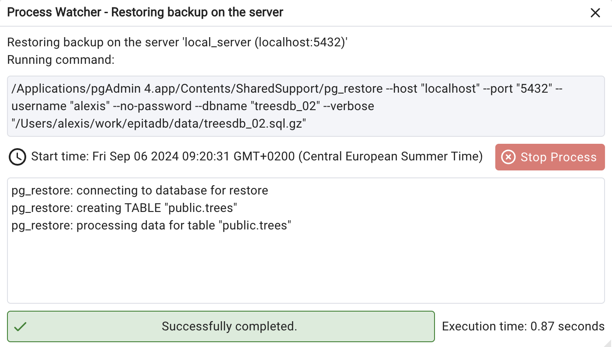

# Connecting to postgres

We want to have

- a running postgresql 16 or 15 install on your machine
- pgAdmin installed
	
## Server vs db

You connect to a postgres **server** 

On that server you may have zero, one or multiple databases.

When you launch postgres on your local, you launch the postgres server.

You on the command line using psql or in pgAdmin


#### Connecting on local server

The host name is ```localhost``` 

```psql -U postgres```

if you do not specify the database name psql will try to connect to a database with the name of the user. 


## Users
The ```postgres``` user is the super user. 

It can do anything on the server, create and manage databases, users, etc 

Installing postgreSQL also creates a user with your machine user name : _username_

The _username_ user is not as powerful as the postgres user

Attention, on mac, there is no postgres user. The superuser is your _username_

## Connecting to the server

You can connect in the terminal or using an app like pgAdmin

In the terminal you use ```psql``` to connect

psql takes the following parameters

-U username
-h host (IP address or local host)
-p port
-d database_name

port is by default 5432 and does not have to be specified each time.


so to connect to a local instance of a postgres server with user bob and database treesdb
> psql -U bob  -d treesdb

to connect to a remote server IP: 123.456.789.246 same user and database
> psql -U bob -h 123.456.789.246 -d treesdb


to see your current user run 
>  psql -c "\conninfo" 

if it complains of not knowing the database, add the postgres database as the database name
> psql -c "\conninfo" -d postgres

This should return: 

> _You are connected to database "postgres" as user "alexis" via socket in "/tmp" at port "5432"._

#### in pgAdmin, 

Open pgAdmin
b. Right-click on "Servers" in the left panel and choose "Create" > "Server..."
c. In the "Create - Server" dialog:

**General tab**:

Name: Give it a name like "Local PostgreSQL"


**Connection tab**:

Host name/address: localhost
Port: 5432 (default PostgreSQL port)
Maintenance database: postgres 
Username: [your_username] 
Password: Leave blank if you haven't set one

to connect to a remote server, just change the connection tab parameters

#### On windows

* Install postgres and follow the instructions
* click on the psql exe file
* it will open a terminal window and prompt you with hostname

    * if you're connecting on local just press enter
    * if you're connecting to remote add the IP address

Same with the other parameters


# Loading a csv dataset

The steps are

1. create the database. let's call it treesdb. 	you can do that either 
	2. on the command line with ```createdb treesdb```
	3. in psql, with CREATE DATABASE ...
2. create the table let's call it ```trees```
3. upload the data from the csv file into the trees table with

\COPY ....


# Load from a sql file

find the treesdb.sql.gz file in the github repo

from the command line 
> pg_dump -U alexis -d arbresdb -F c -Z 9 -f /Users/alexis/work/epitadb/data/treesdb.sql.gz

or with pgAdmin: 
* connect to local server (servername : localhost, username your_username, ...)
* right click on server and > create > database
* give it the name : treesdb and check the encoding is UTF8
* Then right click on the treesdb databse 

In the restore dialog:

* Set "Format" to "Custom or tar" 
* Browse and select your dump file.
* In the "Sections" tab, make sure "Pre-data", "Data", and "Post-data" are all checked.
* In the "Options" tab, find "Do not save" and check the box next to "Owner".
* Also in the "Options" tab, find "Schemas" and enter "public" in the text box (this ensures all objects are restored to the public schema).


# Check the data

You should have a single table called trees with the columns you created.


# Changing the Encoding

We need the database to be UTF8 encoded for the Paris trees data. 

if you notice that the accent in some columns are not properly encoded 
for instance é is displayed as é, à as à ...

> UPDATE trees SET column_name = convert_from(convert_to(column_name, 'LATIN1'), 'UTF8')

do that for the columns : name, genre, species, variety, address ...
 
you can also check that server, client and table are UTF8 encoded with

> SHOW server_encoding;
> SHOW client_encoding;
> SELECT pg_encoding_to_char(encoding) FROM pg_database WHERE datname = 'treesdb';

# 2nd Day start with

* You have a running install of postgreSQL on your local 
* You have pgAdmin installed


Then 

* Launch pgAdmin

If the database ```treesdb``` already exists, delete it. (right click on the database name)

Download the ```treesdb_02.sql.gz``` file in the github repo. 

> https://github.com/SkatAI/epitadb/blob/master/data/treesdb.sql.gz


This is a version of the database with the proper encoding. 


**create the new database**

* create a new database called treesdb_02
* set the user to your usename (should appear in the dropdown)
* set the encoding to UTF8

The SQL tab should show 

```sql
CREATE DATABASE treesdb_02
    WITH
    OWNER = alexis
    ENCODING = 'UTF8'
    LOCALE_PROVIDER = 'libc'
    CONNECTION LIMIT = -1
    IS_TEMPLATE = False;
```
**restore the database**

Then click right on the treesdb_02 database and click on restore

* select the filename treesdb_02.sql.gz, 
* select format custom or tar
* click restore

while the db is restored, look at the process




Then check that the tree table has been created in the public schema of the treesdb_02 database


* select random rows
* \d trees


