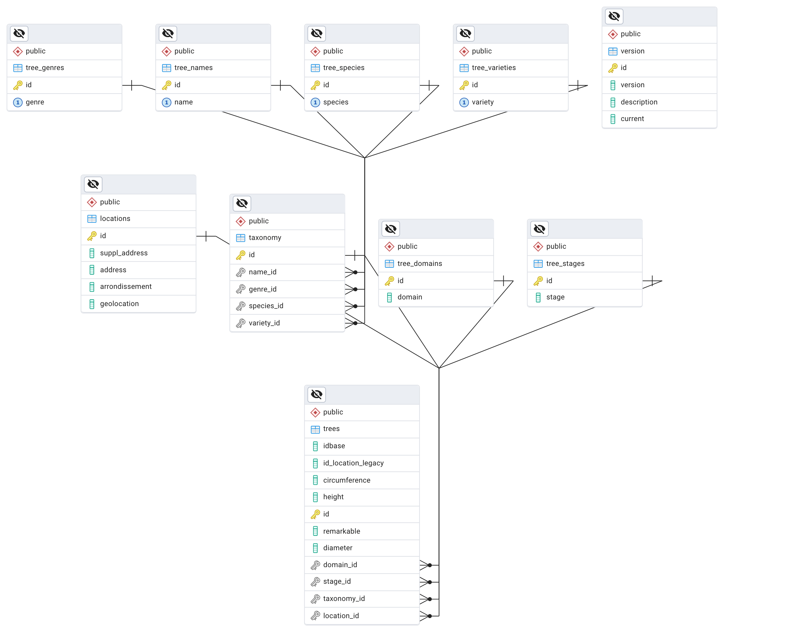

# Normalize treesdb

## Context
In this document we are working with the ```treesdb_v02``` database.

If you haven't done so already, connect to your local postgreSQL server and restore the file from the github repo

[github > SkatAI > epitadb > data > treesdb_v02.01.sql.backup](https://github.com/SkatAI/epitadb/blob/master/data/treesdb_v02.01.sql.backup)

In the terminal (mac or powershell ), on local

psql with (Mac):

```bash
psql -U <localusername> -d postgres
```
or (Windows):

```powershell
psql -U postgres -d postgres
```


create the database ```treesdb_v03``` , (1st delete it if it exists):

```sql
DROP database if exists treesdb_v03 WITH(force) ;

CREATE DATABASE treesdb_v03
    WITH
    OWNER = <postgres (win) or your_local_username (mac)>
    ENCODING = 'UTF8'
    LOCALE_PROVIDER = 'libc'
    CONNECTION LIMIT = -1
    IS_TEMPLATE = False;
```

Then back in the terminal (exit psql with ```\q```)

```bash
pg_restore -d treesdb_v03 \
-U postgres \
--no-owner \
--no-privileges \
--no-data-for-failed-tables \
--section=pre-data \
--section=data \
--section=post-data \
--verbose \
--exit-on-error  \
--single-transaction \
<path to your file>/treesdb_v02.01.sql.backup
```

### Nice

You can test that the data was uploaded from the command line in the terminal by using psql to connect execute a query at the same time :

```bash
psql  -U postgres -d treesdb_v03 -c "select * from trees order by random() limit 1;"
```

This should retturn the number of tree records in the trees table.


## Goal

The goal of this exercise is to transform the flat, one table, ```treesdb``` database into a fully normalized database by applying 1NF, 2NF and 3NF forms.

For each entity that needs a dedicated table, the process is:

1. create a new table with a primary key
2. inserts values from the trees column
3. add a foreign key to the trees table
3. delete the original column

The entity can be composed of multiple original columns.
For instance, it makes sense to regroup  ```address```, ```arrondissement```, ```geolocation``` and ```suppl_address``` in a ```location``` table.


## Example with ```name```

The ```name``` column in the trees table is a categorical column.

* the most frequent tree name is **Platane** with 42841 occurences followed by 24945 marronniers
and  22317 tilleuls.
* for a total of 214 different names.
* 28 names correspond to one tree. Deletion anomaly
* 186 names occur more than once. Update anomaly
* 1339 trees have a NULL value for ```name```)

The column ```name``` is a good candidate for normalization.

* First create a new table called ```tree_names```. Very simple, it has one primary key and only one column ```name```

```sql
create table tree_names (
    id serial primary key,
    name varchar unique not null
);
```

Note the ```unique``` and ```not null``` constraints.

Having null values in the ```tree_names``` table would defeat the purpose of normalization.


* Then inserts values from the trees column

```sql
INSERT INTO tree_names (name)
SELECT DISTINCT t.name
FROM trees t
WHERE t.name IS NOT NULL;
```

* create a foreign key in the trees table: ```name_id```

```sql
ALTER TABLE trees ADD COLUMN name_id INTEGER;
```

* then update the foreign key column with the correct IDs: ```trees.name_id <-> tree_namess.id```

```sql
UPDATE trees t
SET name_id = tn.id
FROM tree_names tn
WHERE t.name = tn.name;
```

* add the foreign key constraint

```sql
ALTER TABLE trees
ADD CONSTRAINT fk_tree_names
FOREIGN KEY (name_id)
REFERENCES tree_names(id);
```

* check that all the names in the trees table are present in the tree_names table

The query should return 0 rows

```sql
select count(*)
from trees t
join tree_names tn on tn.id = t.name_id
where t.name != tn.name;
```

* finally, delete the name column in the main trees table

```sql
ALTER TABLE trees
DROP COLUMN name;
```

### variations
Notice that the names in the new tree_names table follow no particular order.

To keep things really tidy, it would be great to have the name column be ordered alphabetically


To do so we must modify the insert query:

```sql
INSERT INTO tree_names (name)
SELECT DISTINCT name
FROM trees
WHERE name IS NOT NULL;
```


And use instead:

```sql
INSERT INTO tree_names (name)
SELECT DISTINCT name
FROM trees t
WHERE t.name IS NOT NULL
ORDER BY t.name asc;
```

Exercice: Insert the names ordered by their frequency of occurences in the trees table so that most frequent names are at the top of the tree_names table.


## Query the names

Now to get the name of a tree we need to JOIN the tables trees and tree_names.

```sql
select t.*, tn.*
from trees t
join tree_names tn on tn.id = t.name_id
where t.id = 888;
```

Though a little bit more complex than a simple query, we now can


* insert new names (for instance for future trees) simply by adding a new row in the ```tree_names``` table,
* update a particular name without updating the trees table,
* and even delete a tree with a unique name without making the name disappear.


---

# Identify the logical entities

Which logical entities do we need to extract and regroup in a dedicated table?

- localisation
- naming, species, genre, variety ?
- dimensions
- what about idbase, remarkable, and anomaly ? can these stay in the trees table ?
- does arrondissement need its own table ?


Let's look at the columns and group them by logical entities


## Ids

We can keep the ids in the trees table:

* ```id```
* ```id_location```
* ```idbase```

Same with the flags ```remarkable``` and ```anomaly```


## Domain & Stage

Let's start with the columns **domain & stage**.

Both columns are categorical columns, show insertion, update and deletion anomalies an have null values. So they  should each be given their dedicated table:


## Addresses and locations

It makes sense to regroup all the columns associated with the localization of the tree.

* address
* suppl_address
* arrondissement
* geolocation

Note the weird format of the ```arrondissement```, the lack of postal code etc ... These addresses are not standard.

### Reconciling keys

One step in the normalization process consists in reconciling the keys by matching the value of the fields in the main and secondary tables.
For the locations table we could assume that each trees has a unique geolocation. And we would be wrong!

There are 12 geolocation duplicates in the trees table.

```sql
SELECT COUNT(*) as tree_count, geolocation::text
FROM locations
GROUP BY geolocation::text
HAVING COUNT(*) > 1
ORDER BY tree_count DESC;
```

A quick check will show that geolocation duplicates all have the same address. So we can delete these duplicates and fall back to reconciling the keys based on the geolocation points.

The sql to delete the geolocation duplicates is more complex.

```sql
WITH numbered_duplicates AS (
    SELECT id, geolocation,
           ROW_NUMBER() OVER (PARTITION BY geolocation::text ORDER BY id) as row_num
    FROM locations
    WHERE geolocation::text IN (
        SELECT geolocation::text
        FROM locations
        GROUP BY geolocation::text
        HAVING COUNT(*) > 1
    )
)
DELETE FROM locations
WHERE id IN (
    SELECT id
    FROM numbered_duplicates
    WHERE row_num > 1
);
```

Note: Another way to avoid duplicates is to cast geolocation as text and use
```insert from select distinct``` in the insert query and then to recast geolocation as point.
That may be simpler.


### the BAN

There is a national database of addresses called BAN (Base Nationale d'Adresse) available at [adresse.data.gouv.fr/base-adresse-nationale](https://adresse.data.gouv.fr/base-adresse-nationale)

It has an api and you can find an address given location coordinates

> curl "https://api-adresse.data.gouv.fr/reverse/?lon=2.323473607304248&lat=48.88237276393427&limit=1"

returns

```json
{
    "type":"FeatureCollection",
    "version":"draft",
    "features":[
        {
        "type":"Feature",
        "geometry":{"type":"Point","coordinates":[2.323387,48.882396]},
        "properties":{
            "label":"25 Rue Clapeyron 75008 Paris",
            "score":0.9999999813107335,
            "housenumber":"25",
            "id":"75108_2067_00025",
            "name":"25 Rue Clapeyron",
            "postcode":"75008",
            "citycode":"75108",
            "x":650379.56,
            "y":6864921.3,
            "city":"Paris".....
```

We could sanitize the addresses by feeding the long, lat into the API, and adding the properly formatted address to the location of the trees. But that's out of the scope of the exercise


## Taxonomy

Taxonomy includes everythign related to the nature of the tree. In our case it englobes the columns : ```name```, ```genre```, ```species``` ```and variety```


Note that there's is an intrinsic relation between the name, genre, species and variety of a tree. Not sure which one. but this hierarchy probably should be kept.

So, our options are:

- one table per column (2NF) (but we loses the relation between the different categories)

or

- one taxonomy table (keeps the relations between the different categories but will require having NULL values)
- and one table per column

We will implement the second choice to conserve the relation between the trees name, genre etc ....


##  Measurements

Should the tree measurements be kept in the trees table or should they have their own separate table ?

* circumference
* height
* diameter


To answer consider these questions

* **Functional dependency**: Do these dimensions depend solely on the tree's ID, or could they change independently?
* **Update anomalies**: Would keeping them in the main table cause update anomalies?
* **Data redundancy**: Is there any repetition of this data across multiple trees?
* **Query patterns**: How frequently are these dimensions accessed along with other tree data?

One piece of data is painfully missing from the trees table ... we don't know when each tree was last measured, there is no survey date.

If a survey date was available then we could record multiple measures for a given tree. It would definitely make sense to give the measurements a separated dedicated table.

However since there is no date for each measurements, each tree has one unique set of measures that is not going to change often (or so we guess). So let's keep the measurements in the trees table to keep things simple.


# Final structure

The target structure is


| column       | table  |
|--------------|--------|
| id           | trees  |
| id_location  | trees  |
| idbase       | trees  |
| remarkable   | trees  |
| anomaly      | trees  |
| height       | trees  |
| circumference | trees  |
| diameter       | trees  |


| column         | table    |
|----------------|----------|
| address        | locations |
| suppl_address  | locations |
| arrondissement | locations |
| geolocation    | locations |


| column | table       |
|--------|-------------|
| domain | tree_domains |
| stage  | tree_stages  |


| column | table       |
|--------|-------------|
| name | tree_names |
| genre  | tree_genres  |
| species  | tree_species  |
| variety  | tree_varieties  |

We also create the ```taxonomy``` table to link the tree to its name, genre, species and variety




### **Note**

In the example given above we normalized the name column.

In the target schema, the tree_names table is linked to the taxonomy table not directly to the trees table.

To avoid confusion you should restart from scratch and restore the treesdb_v02 database.

