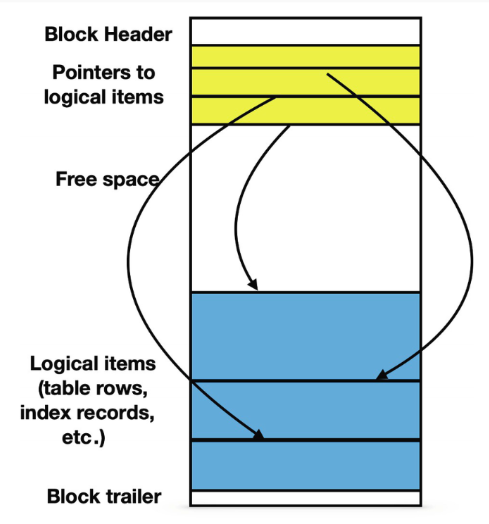

# Scope

In this lesson we look at assessing and improving query performance with the use of the EXPLAIN command and indexes.

Let's start with a bit of overview. And then dive in the technical details or query planning.
## SQL is a declarative language

SQL is a **declarative** language not an **imperative** language.

Declarative languages focus on what the outcome should be, rather than how to achieve it. The **what** not the **why**.
When we write a query, we specify what the results should be.
The PostgreSQL _engine_ interprets the query and determines how to implement it, the steps required to achieve those results.

* **Declarative** languages include : HTML, css, ... specifying the layout
* **Imperative** languages are: python, javascript, Go, Java etc ... and bash

## The *relation* in _Relational database_

Relational database come from **relation** theory.

A small example:
* A and B are sets of objects: for instance A = {1,2,3}, B = {a,b,c}
* _tuples_ are combination of elements of these objects : (1,a), (1,b), …, (3, c)

In that context, a database **table** is a **subset** of all the possible combinations of the values of its columns.

For instance, a table with columns A and B that can respectively take the values {1,2,3} and {a,b,c} is :

| A   | B   |
| --- | --- |
| 1   | c   |
| 1   | b   |
| 3   | a   |
| 2   | b   |

That's all for relation theory!

For more on that subject: chapter 2 and 3 of _PostgreSQL Query Optimization_2021_ (see the discord channel for the pdf)

### Everything is a relation

One important concept from relation theory, is that 

> an **operation** on a **relation** produces ... another **relation**!

Keep in mind that the whole table aka a relation is already a subset of all possible column value combinations.

* **Depth**: A SELECT based on WHERE conditions, subsets the table
* **Width**: A SELECT on specific columns : subsets the attributes

 A SELECT query produces a subset of the subset.

> Depth x Width : (number of rows) x (number of attributes)

Which implies:

* **a query produces a relation**
* a column can have values that are relations

We saw something similar in the definition of the 1NF form:

> A relation is in 1NF
> if and only if
> no attribute domain has **relations** as elements.

Understanding that, sets of rows are in fact relations helps with the versatility of the SQL language.

For instance, it makes sense to use temporary relations defined from named queries using ```WITH ... AS```.

## The query planner

The **database optimizer** or **query planner** or **engine** chooses the most efficient method to deliver the results as expressed by the query.

The database optimizer interprets SQL queries along this process:

* **compilation**: transforms the query into a high level logical plan
* **optimization**: transforms logical plan into execution plan by choosing the most efficient  algorithms for the job
* **execution**: executes the algorithms

The EXPLAIN \<query\> command outputs the execution plan of a query.

### Algorithms! Woo! 

Here, think of **algorithms** as the actual **physical operations** that take place when the query plan is executed: 

- getting to the data which is stored in memory or in physical storage, 
- scanning the data, 
- looking up indexes, 
- filtering, sorting etc.

In the context of the PostgreSQL query optimizer, an **algorithm** is a systematic method to analyze, plan, and execute database queries efficiently.

## Choosing the right Algorithm

How does the query planner chooses the best algorithms to execute the query ?

Many factors can be involved

* the nature of the tables and the data
* the query itself
* the type of filter (WHERE) operator `:` `=`, `<`, `between`, `like '%string'` etc
* the data types of the columns involved in the filters
* the number of rows of the table or the subqueries etc
* presence of `limit`, `order by`,  ...
* full text search is a topic by itself

and 

* the performance of the machine

For each set of data (distribution, type) and table indexes, etc ... there are specific rules and heuristics on which the query planner will base its choice of the most efficient algorithm to execute the query.

Understanding a query plan can be difficult.

Straight from the documentation : **Plan-reading is an _art_ that requires some experience to master, ....** 
🤣🤣🤣 emphasis here on the word _art_.

## Planning and Cost reduction

Given a query, the role of the query planner is to find the most **efficient** way to execute it.

But what is **efficient** ?
Let's say for the moment that efficient means fast.

The optimizer minimizes the **cost of execution** to lower execution time.:

* rewrites the query
* chooses the most efficient physical operations (i.e. algorithms) to execute the query

## Cost function

However, the real execution time of a query also depends on the machine the server is running on. This machine may be brand new and powerful, or old and barely functionning. It may also be running processes that consume precious available resources.

The query optimizer does not have access to the overall machine context and the overall query time as experienced by the user is unknown to the optimizer.
The optimizer also does not have access to external metrics such as monetary cost, user satisfaction, etc.

Instead the optimizer combines a measure of **CPU cycles** and **I/O accesses** to 1) derive a **cost function** and 2) minimize this cost function.

> The **query optimizer** relies on resources that affect execution time: CPU cycles and I/O access which it combines into a **single cost function** that it tries to minimize.

Depending on the machine that hosts the PostgresSQL server, PostgresSQL assigns different weights to these different variables to calculate the cost of a query

For instance, the `cpu_operator_cost` is defined as: _Sets the planner's estimate of the cost of processing each operator or function executed during a query. The default is 0.0025._

```sql
SHOW cpu_operator_cost;
```

returns:

```bash
 cpu_operator_cost
-------------------
 0.0025
```


Whereas, the `cpu_tuple_cost` is defined as : *Sets the planner's estimate of the cost of processing each row during a query. The default is 0.01.*

There is a total of [13 cost related weights](https://www.postgresql.org/docs/current/runtime-config-query.html#RUNTIME-CONFIG-QUERY-CONSTANTS). Each dedicate to a specific operation. All have default values.

## Blocks, storage and I/O access

There's no magic.  At the bottom of things the database data is stored in files.

Let's find where that data is with:

```sql
SHOW data_directory;
```

These are the folders you will find. The data is stored in `base`.

| Folder          | Description                                              |
|-----------------|----------------------------------------------------------|
| `base`         | Stores actual data for user-created databases.           |
| `global`       | Contains system-wide metadata and cluster control files. |
| `pg_wal`       | Write-Ahead Logs for transaction logging and recovery.   |
| `pg_multixact` | Manages MultiXact transactions for row locking.          |
| `pg_subtrans`  | Tracks sub-transactions for nested transactions.          |
| `pg_commit_ts` | Stores commit timestamps of transactions.                |
| `pg_tblspc`    | Symbolic links to tablespaces for external data storage. |
| `pg_stat_tmp`  | Temporary statistics data for monitoring performance.    |
| `pg_snapshots` | Stores transaction snapshots for MVCC isolation.         |
| `pg_twophase`  | Manages two-phase commit transactions.                   |
| `pg_logical`   | Handles logical replication and WAL decoding.            |
| `pg_replslot`  | Stores replication slots for data streaming replication. |
| `pg_serial`    | Tracks serializable transactions.                        |
| `pg_stat`      | Collects statistics about database activity.             |
| `pg_xact`      | Tracks transaction commit/abort statuses.                |
| `pg_dynshmem`  | Stores dynamic shared memory for process coordination.   |
> take a minute to look it up on your machine

Any file used for database objects is divided in **blocks** of the same length.

A block is the unit that is transferred between the hard drive and the main memory, and the number of I/O operations needed to execute any data access is equal to the number of blocks that are being read from or written to.

By default, PostgreSQL uses blocks containing 8192 bytes each.

Looking up one of the subfolders `/1` of `base`:

```bash
ll  /usr/local/var/postgresql@16/base/1
total 15304
drwx------  301 alexis  admin   9.4K  6 Sep 09:05 .
drwx------   16 alexis  admin   512B 23 Sep 11:55 ..
-rw-------    1 alexis  admin   8.0K 22 Mar  2024 112
-rw-------    1 alexis  admin   8.0K 22 Mar  2024 113
-rw-------    1 alexis  admin   120K 22 Mar  2024 1247
-rw-------    1 alexis  admin    24K 22 Mar  2024 1247_fsm
-rw-------    1 alexis  admin   8.0K 22 Mar  2024 1247_vm
-rw-------    1 alexis  admin   456K 22 Mar  2024 1249
```

Several small items can reside in the same block; larger items may spread among several blocks.



## EXPLAIN  \<SQL\>

You can use the ```EXPLAIN``` command in front of a SQL query to see the query plan the planner creates for that query.

Postgresql optimization engine is excellent but sometimes needs troubleshooting.

> **Important** : The optimization engine will return different plans depending on the machine it runs on so the same query may result in different execution plans on different hardware.

### Example

Let's look at the query plan for a query on the WorldHits database: the `versatility_score` query from S04.04.

Just add EXPLAIN in front of the query:

```sql
EXPLAIN WITH artist_stats AS (
    SELECT
        artist,
        COUNT(*) AS track_count,
        ROUND(CAST(STDDEV(energy) AS numeric), 2) AS energy_std,
        ROUND(CAST(STDDEV(danceability) AS numeric), 2) AS danceability_std,
        ROUND(CAST(STDDEV(acousticness) AS numeric), 2) AS acousticness_std,
        ROUND(CAST(STDDEV(instrumentalness) AS numeric), 2) AS instrumentalness_std
    FROM tracks
    GROUP BY artist
    HAVING COUNT(*) >= 5
),
artist_versatility AS (
    SELECT
        artist,
        track_count,
        ROUND(CAST( (energy_std + danceability_std + acousticness_std + instrumentalness_std) AS numeric), 2) AS versatility_score
    FROM artist_stats
)
SELECT
    artist,
    track_count,
    versatility_score
FROM artist_versatility
ORDER BY versatility_score DESC
LIMIT 10;
```

The execution plan is:

```sql
QUERY PLAN
-------------
Limit  (cost=27.77..27.80 rows=10 width=54) (actual time=0.498..0.501 rows=10 loops=1)
  ->  Sort  (cost=27.77..27.83 rows=22 width=54) (actual time=0.497..0.498 rows=10 loops=1)
        Sort Key: (round((((artist_stats.energy_std +  ... + artist_stats.instrumentalness_std), 2)) DESC
        Sort Method: top-N heapsort  Memory: 26kB
        ->  Subquery Scan on artist_stats  (cost=25.15..27.30 rows=22 width=54) (actual time=0.259..0.460 rows=37 loops=1)
              ->  HashAggregate  (cost=25.15..27.08 rows=22 width=150) (actual time=0.257..0.434 rows=37 loops=1)
                    Group Key: tracks.artist
                    Filter: (count(*) >= 5)
                    Batches: 1  Memory Usage: 48kB
                    Rows Removed by Filter: 29
                    ->  Seq Scan on tracks  (cost=0.00..20.26 rows=326 width=46) (actual time=0.014..0.054 rows=326 loops=1)
```

Lots of information!

## Nodes

A **node** in a query plan represents a **single operation** or step in the execution of a query. 
The output of EXPLAIN shows one node per line.

Each node describes a specific action that Postgres will execute, such as

* scanning a table,
* applying a filter,
* joining tables,
* or sorting results.

and information such as an estimation of the associated cost, the number of rows etc ...

Nodes are arranged in a tree structure, with **child nodes** feeding results to their **parent nodes**, ultimately leading to the final result of the query.
## Sequential Scan

Let's look at the query plan for a simple select query.

```sql
explain select * from trees;
                          QUERY PLAN
--------------------------------------------------------------
 Seq Scan on trees  (cost=0.00..4577.39 rows=211339 width=50)
(1 row)
```

The operation is a **Sequential Scan** on the ```trees``` table.

**Sequential Scan**: the algorithm is simply reading all rows from the table in order, from beginning to end. It's the most straightforward way to retrieve all data when no filtering is required.

The query plan shows:

* The **estimated cost** ranges from 0.00 (start-up cost) to 4577.39 (total cost).
* It expects to return **211,339 rows**. (which is in fact the number of rows on the `trees` table)
* The average **width** of each row is estimated to be 50 bytes.

Note: The **width** is the estimated average size of each returned row in bytes.

Since we're selecting all columns and all rows, PostgreSQL has no choice but to read the entire table sequentially.

A Sequential Scan is the most efficient method for retrieving all data from a table.

### The Cost of a Sequential Scan

The estimated cost for a Sequential Scan is computed as :

```bash
(number of pages read from disk * seq_page_cost) + (rows scanned * cpu_tuple_cost).
```

By default, ```seq_page_cost = 1.0``` and ```cpu_tuple_cost = 0.01```,

see <https://www.postgresql.org/docs/current/runtime-config-query.html#GUC-SEQ-PAGE-COST> and <https://www.postgresql.org/docs/current/runtime-config-query.html#GUC-CPU-TUPLE-COST>

We can lookup the number of pages for a given table with

```sql
SELECT relname, relkind, reltuples, relpages
FROM pg_class
WHERE relname = 'trees';
```

which returns

```bash
  relname    | relkind | reltuples | relpages
--------------+---------+-----------+----------
 trees        | r       |    211339 |     2464
```

The trees table occupies 2464 pages.

So the estimated cost is **(2464 * 1.0) + (211339 * 0.01) = 4577.39** which is the exact number shown in the query plan.
### The `pg_class` table

The `pg_class` table in PostgreSQL is a system catalog that contains metadata about tables, indexes, sequences, views, and other relation-like objects.

| Column            | Description                                                                 |
|-------------------|-----------------------------------------------------------------------------|
| `relname`         | Name of the relation (table, index, etc.).                                   |
| `reltuples`       | Estimated number of rows in the table or index.                              |
| `relpages`        | Number of disk pages that the table or index uses (approximate).             |
| `relkind`         | Type of relation: 'r' (table), 'i' (index), 'S' (sequence), 'v' (view), etc. |
| `relhasindex`     | `true` if the table has any indexes.                                         |
| `...`     | other columns |

`pg_class` tracks:

* Tables and Views
* Indexes
* Sequences
* Materialized Views
* Partitions

## EXPLAIN ANALYZE

> EXPLAIN ANALYZE complements the EXPLAIN command by also sampling the data and calculating statistics that will be used to optimize the plan.

> While EXPLAIN uses default statistical estimates about the data, EXPLAIN ANALYZE uses real stats.

Furthermore, EXPLAIN ANALYZE

* effectively runs the query (but does not display the output)

And returns: 

* the real execution time
* the true number of rows

It also outputs:

* **I/O timings**: time spent on I/O operations.
* **Worker information**: Details about workers used in parallel queries.
* **Memory usage**: memory used during query execution.
* **Buffers information**: details about shared and local buffer usage, including hits and reads.

### EXPLAIN ANALYZE on updates

Since EXPLAIN ANALYZE actually runs the query, you have to be cautious when using it on UPDATE, INSERT or DELETE queries 🧨🧨🧨

The best pratice is to use EXPLAIN first to get a rough idea about possible optimizations then after you've optimized the tables and your query, and then run EXPLAIN ANALYZE to get an accurate timing of the query execution

### Rollback

To analyze a data-modifying query without changing the tables, wrap the EXPLAIN ANALYZE statement between `BEGIN` and `ROLLBACK`. That way the query will be rolled back after its execution.

For instance:

```sql
BEGIN;

EXPLAIN ANALYZE UPDATE trees SET height = height / 10 WHERE height > 100;

ROLLBACK;
```

## EXPLAIN : WHERE clause

Let's add a `where` clause on the height attribute, to our simple `select * from trees;` and see what the optimizer makes of it

```sql
EXPLAIN select * from trees where height < 9;
```

returns:

```sql
                          QUERY PLAN
--------------------------------------------------------------
 Seq Scan on trees  (cost=0.00..5105.74 rows=111270 width=50)
   Filter: (height < 9)
(2 rows)
``` MMi

Compare that to the original query plan without the filter:

```sql
                          QUERY PLAN
--------------------------------------------------------------
 Seq Scan on trees  (cost=0.00..4577.39 rows=211339 width=50)
```

So the cost has gone up (4577.39 -> 5105.74) while the number of rows has gone down (211339 -> 111270) !

We're asking the Seq Scan node to check the condition for each row it scans, and outputs only the ones that pass the condition.

The estimate of output rows has been reduced because of the WHERE clause.

However, the scan still has to visit all 211339 rows, so the cost hasn't decreased; in fact it has gone up a bit (by `211339 * cpu_operator_cost` you can check) to reflect the extra CPU time spent checking the WHERE condition.

```
treesdb_v04=# SHOW cpu_operator_cost;
 cpu_operator_cost
-------------------
 0.0025
(1 row)
```

Now the cost is given by

```bash
(number of pages read from disk * seq_page_cost) + \
(rows scanned * cpu_tuple_cost) + \
(rows scanned * cpu_operator_cost)
```

### The impact of indexing and Bitmap Scans

The trees table for the primary key ```id```

```sql
\d+ trees
Indexes:
    "trees_pkey" PRIMARY KEY, btree (id)
Access method: heap
```

Let's see how this index `trees_pkey` is put to use by the query planner when we filter on ```id``` instead of ```height```

```sql
EXPLAIN select * from trees where id < 1000
```

We get

```sql
                                  QUERY PLAN
------------------------------------------------------------------------------
 Bitmap Heap Scan on trees  (cost=189.37..2777.48 rows=9929 width=50)
   Recheck Cond: (id < 10000)
   ->  Bitmap Index Scan on trees_pkey  (cost=0.00..186.89 rows=9929 width=0)
         Index Cond: (id < 10000)
(4 rows)
```

The query planner executed a two step plan where the **child** node: **Bitmap Index Scan** feeds the rows into a **parent** node: **Bitmap Heap Scan**.

`HEAP` meaning the entire table.

The overall costs has gone down since the parent scan only has to check the filtering condition on 10k rows.
Notice that the number of rows is not correct: 9929 instead of 9999. EXPLAIN gives out estimates not exact numbers.

## BITMAP

A **bitmap** is a compact data structure used to represent a set of row identifiers.

* **Structure**: It is essentially an array of bits (0s and 1s).
* **Representation**: Each bit corresponds to a row in the table. A '1' indicates the row matches the query condition, while a '0' means it doesn't.
* **Efficiency**: Bitmaps are memory-efficient for representing large sets of rows, especially when dealing with millions of records.
* **Operations**: Bitmaps allow for quick set operations (AND, OR, NOT) when combining multiple conditions.
* **Purpose**: In a **Bitmap Heap Scan**, the bitmap helps the database quickly identify which rows need to be fetched from the table, avoiding unnecessary I/O.

## Difference between Bitmap Heap Scan and Seq Scan

* Sequential Scan (Seq Scan):

  * Reads all rows in the table sequentially, one after another.
  * Doesn't use any index.
  * Efficient for reading a large portion of the table.

* Bitmap Heap Scan: Uses a two-step process:

  * a) First, it creates a bitmap in memory where each bit represents a table block.
  * b) Then, it actually fetches the rows from the table based on this bitmap.
  * Often used when an index scan returns a moderate number of rows.

The key difference lies in how these methods access the data:

* Reading sequentially in Seq Scan: The database reads all data pages in order, one after another. This is efficient because it follows the natural order of data on disk.

* Fetching rows separately in Bitmap Heap Scan: After creating the bitmap, the database jumps around the table to fetch only the specific rows that match the condition.

> This involves more random I/O operations, which are generally slower than sequential reads.

In the end, the cost is lower with a bitmap scan because the planner has to deal with a much smaller number of rows

BUT 
if the filtering is less stringent, the planner will revert back to a Seq Scan

For instance:

```sql
treesdb_v04=# EXPLAIN select * from trees where id < 150000;
                          QUERY PLAN
--------------------------------------------------------------
 Seq Scan on trees  (cost=0.00..5105.74 rows=149967 width=50)
   Filter: (id < 150000)
(2 rows)
```

Because in that case since the filtering is too large, the advantage of using a bitmap scan becomes too small.

Note: We could probably plot a curve by increasing the id threshold and seeing when the cutoff from Seq Scan to Bitmap Scan occurs

## Explore some more

EXPLAIN the following queries

### Index Scan

```sql
select * from trees where id = 808;
```

```sql
select * from trees where id < 10000 and stage_id = 1;
```

In that query, why does the cost not lower (343 rows in the parent node)

The added condition ```stage_id = 1;``` reduces the output row count estimate, but not the cost because we still have to visit the same set of rows. Notice that the stage_id = 1 clause cannot be applied as an index condition, since this index is only on the id column. Instead it is applied as a filter on the rows retrieved by the index. Thus the cost has actually gone up slightly to reflect this extra checking.

### Equality on a column with index

```sql
treesdb_v04=# explain select * from trees where id = 808;
                               QUERY PLAN
-------------------------------------------------------------------------
 Index Scan using trees_pkey on trees  (cost=0.42..8.44 rows=1 width=50)
   Index Cond: (id = 808)
```

The table rows are fetched in index order, which makes them even more expensive to read, but there are so few that the extra cost of sorting the row locations is not worth it. You'll most often see this plan type for queries that fetch just a single row.

It's also often used for queries that have an ORDER BY condition that matches the index order, because then no extra sorting step is needed to satisfy the ORDER BY. In this example, adding ORDER BY ```id``` would use the same plan because the index already implicitly provides the requested ordering.

### Many types of scans

We already have threes types of scans:

* Seq Scan
* Bitmap Heap Scan
* Index Scan

Let's recap

1. Index Scan:

* Used when: Fetching a small number of rows based on an index condition.

* How it works:
  * Directly uses the index to find the location of rows matching the condition.
  * Then fetches those specific rows from the table.
* Efficiency: Very efficient for retrieving a small number of rows, especially with highly selective conditions.
* In your example: It's using the primary key index (trees_pkey) to quickly find the row with id = 808.

2. Sequential Scan (Seq Scan):

* Used when: Reading a large portion of the table or when no suitable index is available.

* How it works:
  * Reads all rows in the table sequentially, one after another.
  * Checks each row against the condition (if any).
* Efficiency: Efficient for reading large portions of a table, but can be slow for selective queries on large tables.

3. Bitmap Heap Scan:

* Used when: Fetching a moderate number of rows based on an index condition.

* How it works:
  * Two-step process:
    a) First, creates a bitmap in memory where each bit represents a table block that contains matching rows.
    b) Then, fetches the actual rows from the table based on this bitmap.
* Efficiency: More efficient than Index Scan when retrieving a larger number of rows, but still selective enough not to warrant a full Sequential Scan.

Key differences:

1. Data access pattern:
   * Index Scan: Might jump around the table to fetch specific rows.
   * Seq Scan: Reads the entire table sequentially.
   * Bitmap Heap Scan: First creates a map of relevant blocks, then fetches those blocks (which can be more organized than Index Scan but less sequential than Seq Scan).

2. Use of indexes:
   * Index Scan: Directly uses the index.
   * Seq Scan: Doesn't use any index.
   * Bitmap Heap Scan: Uses an index to create the bitmap, then accesses the table.

3. Suitability for different data volumes:
   * Index Scan: Best for very selective queries (few rows).
   * Seq Scan: Best for reading large portions of the table.
   * Bitmap Heap Scan: Good middle ground for moderate selectivity.


## Conclusion

Next time we look at creating indexes and optimizing query execution time.
