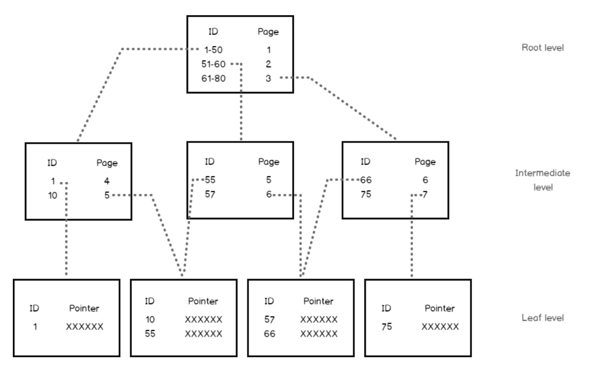

# Indexes

- What are indexes ?
- How do indexes work ?
- What are they used for ?
- any trade-offs when creating indexes ?
- Do they always speed up queries ?
- when to create an index
- What are the different sorts of indexes and when to use them ?

# What is an index

A data structure is called an index if it is:
- A redundant data structure
- Invisible to the application
- Designed to speed up data selection based on certain criteria


- **redundancy** : redundancy means that an index can be dropped without any data loss and can be reconstructed from data stored elsewhere
- **invisibility** : Invisibility means that an application cannot detect if an index is present or absent. That is, any query produces the same results with or without an index.
- **performance** : an index is created with the hope that it improves performance of a specific query
Generally speaking, the speed-up is achieved due to a fast check of some filtering conditions in a query (WHERE).

An index in a database is like an index in a book.


## Create an index

In postgreSQL, uniqueness constraints (UNIQUE, PRIMARY KEY) on columns automatically create an unique index.

Without an index, checking uniqueness for primary keys or unique constraints would require a full table scan, which can be inefficient for large datasets. 
By using an index, PostgreSQL can quickly determine whether a value already exists in the column or not.


1. **Primary Key **: When you define a primary key on a table, PostgreSQL automatically creates a unique index on the column(s) involved to enforce the uniqueness constraint of the primary key.

2. **Unique Constraints**: Similarly, when you define a `UNIQUE` constraint on one or more columns, PostgreSQL creates a unique index to enforce this constraint, making sure that all values in the column(s) are distinct across the table.

> PostgreSQL doesn't create an index automatically for foreign keys, it's a good practice to manually create one. Without an index, operations like deleting or updating rows on the referenced table can be slow, as PostgreSQL will need to perform a sequential scan to find matching rows. However, the foreign key itself doesn't automatically generate an index.


You can create an index on any columns or sets of columns with

```sql
CREATE INDEX name ON table USING HASH (column);
```
By default this creates the B-tree index, most common index in postgres
 
You can create other types of indexes with ```USING type_of_index```: 

```sql
CREATE INDEX name ON table USING HASH (column);
```


# Balanced-tree index 

Let's start with the most common index used in postgresql the 
**B-Tree, or balanced tree** and understand how it works.


https://www.youtube.com/watch?v=NI9wYuVIYcA

When we do a Seq Scan we scan at all the rows sequentially.  This lookup a **cost of O(n)** for n rows meaning that the time it takes to look something up doubles when the data doubles.

With B-trees the search has a **cost of O(log(n))**. A doubling of the data implies a factor log_10(2) ~ 1.30 increase in search time.


## Structure

A B-tree index in PostgreSQL consists of the following key elements: Nodes, Branches and pointers

1. **Root Node**: The topmost node that serves as the entry point for all searches.

2. **Internal Nodes**: Nodes between the root and leaf nodes, used for routing searches by storing pointers and key ranges.

3. **Leaf Nodes**: The bottom-level nodes that store the actual index entries (key-value pairs) and pointers to the corresponding table rows.

4. **Keys**: Ordered values in the nodes used to guide searches, ensuring efficient data retrieval.

5. **Pointers**: Links between nodes (in internal nodes) and to table rows (in leaf nodes) for fast navigation through the index.





B-tree stores data such that each node contains keys in ascending order. 
Each of these keys has two references to another two child nodes.  The left side child node keys are less than the current keys, and the right side child node keys are more than the current keys


A block size is 8 Kb in PostgreSQL. 
An 8 Kb block can have dozens of index records.
Consequently, an index with six to seven levels can accomodate billions of index records!

B-trees are very powerful

- huge storage capacity
- super fast retrieval
- limited update impact frm updates, inserts and deletes


## Lifecycle of a B-tree index 


Each time a new entry is inserted, rules are applied to keep the index consistent.

- The B-Tree is constructed so that each branch keeps the same depth. No shallow or very deep branches.
- All records in all blocks are ordered
- All blocks have the same size and max number of records
- All blocks are more than half full and At least 50% of their capacity is utilized.

This reconstruction happens when inserting new data. 
So having a B-tree index on a column adds to the INSERT, UDATE and DELETE costs related to that column.


However, B-trees can be modified without significant overhead. 

- When a record is inserted, the restructuring is limited to one block. 

- If the block capacity is exceeded, then the block is split into two blocks, and the update is propagated to upper levels. 

In the worst case, the number of modified blocks cannot exceed the depth of the tree.


## What are b-tree used for ?


In PostgreSQL, a B-tree index can be created for any ordinal data type; that is, for any two distinct values of the data type, one value is less than the other. This includes user-defined types.


However in some cases B-trees are no efficient: 

- boolean column : that results in 2 main branches, do no great gain here. b-trees are not adapted to boolean colummns
- Very different data like UUIDs or random numbers and many inserts. The B-tree will have to be reorganized often since there is no logic to the values inserted. So also not a good choice
- same thing for datetime, too dynamic


The documentation says 

> B-trees can handle equality and range queries on data that can be sorted into some ordering. 
In particular, the PostgreSQL query planner will consider using a B-tree index whenever an indexed column is involved in a comparison using one of these operators:

> <   <=   =   >=   >

? Constructs equivalent to combinations of these operators, such as BETWEEN and IN, can also be implemented with a B-tree index search. Also, an IS NULL or IS NOT NULL condition on an index column can be used with a B-tree index.

So b-trees are efficient when we want to search using a filter on an ordered column, typically a categorical column with many values, orr a numeric colun.

# when to create an index ?

Think about the type of search you're going to make often in your app.
Then decide on the type of index and whether to create it or not.

Then use Explain to understand what algorithms  the optimizer chooses and detect if there are any slow operations.


So when you want to make a query faster and you see that its explain plan is lacking index support, think about the query in terms of SLA in your application. 

Does this query need to run as fast as possible, even when it means that you now have to maintain more indexes?


# Demo

We'll use the airdb database, 
- EXPLAIN a query on a table without indexes (besides the primary key)
- check out the number of rows and costs returned
- add an index
- verify that the cost has gone down

We'll also add an index on a boolean or date column and see if adding an index impacts the query time and estimmated costs.


# Further reading


- The art of postgreSQL Chapter 8 indexing strategy
- PostgreSQL Query Optimization Chapter 5 Short Queries and Indexes


https://www.freecodecamp.org/news/postgresql-indexing-strategies/
