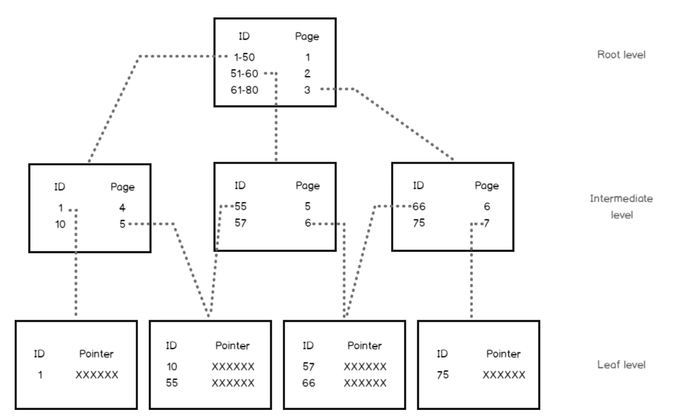
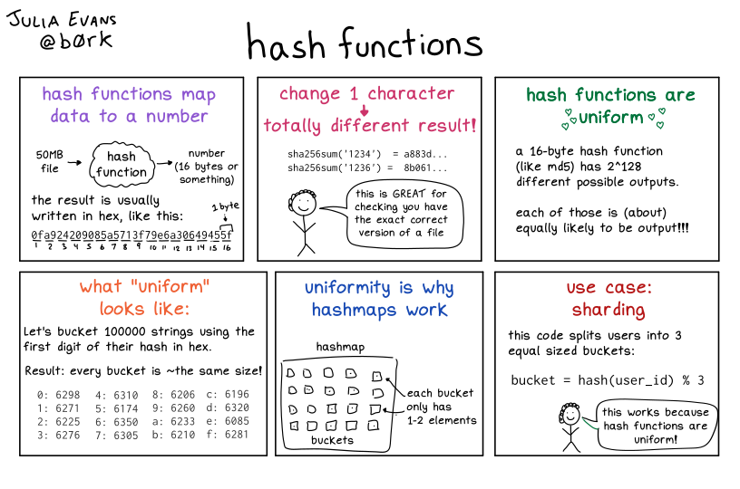
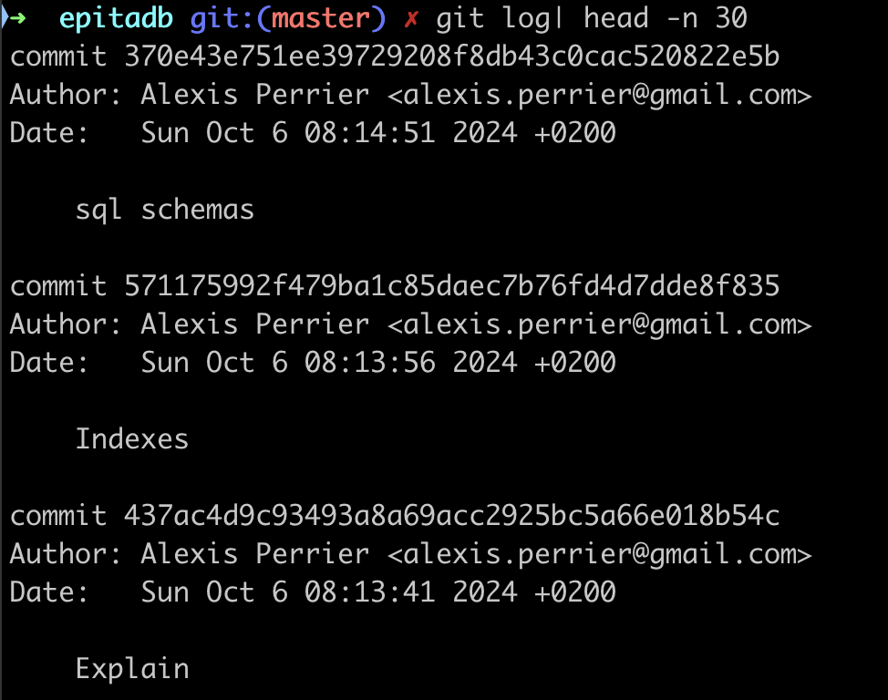

# Indexes

We saw that filtering on a column with or without an index changes the way the query planner plans and executes the query.

## the Plot

Indexes are used to speed up queries by facilitating the filtering part for the planner.

The promise is that a condition over an indexed column is faster than over a non indexed column.

The underlying assumption is that when filtering over an indexed column, that index will always be used.

But in reality this is not always the case.

## The Story

In this session we look at:

- What are indexes ?
- How do indexes work ?
- What are they used for ?
- Any trade-offs when creating indexes ?
- Do they always speed up queries ?
- When to create an index ?
- What are the different sorts of indexes and when to use them ?
  - B-tree indexes
  - Hash indexes

## What is an index ?

> An index is invisible redundant data that boost query execution time.

Which means:

- **Redundancy** : an index can be dropped without any loss of data and can be reconstructed from data stored elsewhere. It reproduces the original column data in a optimized way for retrieval
- **Invisibility** : an external application using the database cannot detect if an index is present or absent. In other words: any query produces the same results with or without an index.
- **Performance** : an index is created with the **hope** that it improves performance of a specific query

> If it was a super hero the index would be an mix of
>
> - the Invisible man
> - Flash
> - Robin (as a redundant sidekick to Batman)
> - and Chaos (for randomness of usage)

### When to create an index ?

First use Explain to understand what algorithms  the optimizer chooses and to detect if there are any slow operations.
Then decide on the type of index and whether to create it or not.

So when you want to make a query faster and you see that its explain plan is lacking index support, think about the query in terms of SLA in your application.

Does this query need to run as fast as possible, even when it means that you now have to maintain more indexes?

## Create an Index

two ways:

- induced by adding UNIQUEness constraint
- manually on a a column

## UNIQUE or PRIMARY KEYS constraints

Adding a UNIQUE or PRIMARY KEY constraint on columns automatically creates a UNIQUE index on that column.

Without an index, checking uniqueness requires a full table scan, which is not efficient for large datasets.

By using a UNIQUE index, PostgreSQL determines whether a value already exists in the column or not.

Note that PostgreSQL doesn't create an index automatically for **foreign keys** and it's a good practice to manually create one. Without an UNIQUE Index on a foreign key, operations like deleting or updating rows on the referenced table can be slow, as PostgreSQL will need to perform a sequential scan to find matching rows.

### Example

We work here on the denormalized version of the trees database: `treesdb_v03`

```sql
 Schema |      Name      | Type  | Owner
--------+----------------+-------+--------
 public | locations      | table | alexis
 public | taxonomy       | table | alexis
 public | tree_domains   | table | alexis
 public | tree_genres    | table | alexis
 public | tree_names     | table | alexis
 public | tree_species   | table | alexis
 public | tree_stages    | table | alexis
 public | tree_varieties | table | alexis
 public | trees          | table | alexis
 public | version        | table | alexis
```

Let's add a [UNIQUE constraint](https://www.postgresql.org/docs/current/ddl-constraints.html#DDL-CONSTRAINTS-UNIQUE-CONSTRAINTS) on the `domain` column of the `tree_domains` table.

```sql
alter table tree_domains add constraint unique_domain  UNIQUE (domain);
```

Then we can for the presence of a new index on that table with `\d tree_domains` :

```sql
Table "public.tree_domains"
 Column |       Type        | Collation | Nullable |                 Default
--------+-------------------+-----------+----------+------------------------------------------
 id     | integer           |           | not null | nextval('tree_domains_id_seq'::regclass)
 domain | character varying |           |          |
Indexes:
    "tree_domains_pkey" PRIMARY KEY, btree (id)
    "unique_domain" UNIQUE CONSTRAINT, btree (domain)
Referenced by:
    TABLE "trees" CONSTRAINT "fk_tree_domain" FOREIGN KEY (domain_id) REFERENCES tree_domains(id)
```

Now the table has 2 indexes, one for the primary key and one for the UNIQUE domain.

Note:

- the presence of the `unique_domain` UNIQUE CONSTRAINT as an Index
- and that both indexes are called `btree`

Sum up:

> Adding a **UNIQUE** constraint on a column automatically creates a **B-tree index** on that column.

## Creating an index

You can create an index on any columns or sets of columns with

```sql
CREATE INDEX index_name ON table  (column);
```

or with `(column1, column2, column3, ...)` for indexes on multiple columns.

By default this creates the **B-tree index**, which is the most common type of index in PostgreSQL.

You can create other types of indexes with ```USING type_of_index (column)```. For instance a `HASH` index:

```sql
CREATE INDEX name ON table USING HASH (column);
```

## Multiple types of indexes

PostgresQL offers multiple types of indexes (see [documentation chapter 11](https://www.postgresql.org/docs/current/indexes.html)).

- B-Tree
- Hash
- GiST and SP-GiST
- GIN
- BRIN

We'll focus on B-tree and Hash Indexes.

## Balanced-tree index (B-tree)

Let's start with the most common index used in PostgreSQL the **B-Tree, or balanced tree** and see how it works.

### performance boost of B-tree indexes

When we do a Sequential Scan the query engine scans all the rows sequentially. This lookup has a **cost of O(n)** for n rows. The time it takes to look something up doubles when the data doubles.

With a B-tree index, the search has a **cost of O(log(n))**. A doubling of the data results in a factor log_10(2) ~ 1.30 increase in search time.

### Structure - How does a B-tree index work ?

The B-Tree index has the structure of a ... Tree! but upside down.

The b-tree index organizes the information in hierarchical blocks following an upside down tree.

A B-tree index in PostgreSQL consists of the following key elements: Nodes, Branches and pointers

1. **Root Node**: The topmost node that serves as the entry point for all searches.

2. **Internal Nodes**: Nodes between the root and leaf nodes, used for routing searches by storing pointers and key ranges.

3. **Leaf Nodes**: The bottom-level nodes that store the actual index entries (key-value pairs) and pointers to the corresponding table rows.

4. **Keys**: Ordered values in the nodes used to guide searches, ensuring efficient data retrieval.

5. **Pointers**: Links between nodes (in internal nodes) and to table rows (in leaf nodes) for fast navigation through the index.



B-tree stores data such that **each node contains keys in ascending order.**

Each of these keys has two references to two child nodes.

- The left side child node keys are less than the current keys,
- the right side child node keys are more than the current keys

A block size is 8 Kb in PostgreSQL. An 8 Kb block can have dozens of index records.

So:

> An index with six to seven levels can accommodate billions of index records!

B-trees are very powerful. They have huge storage capacity and allow for super fast retrieval

B-trees follow certain rules that makes them super efficient:

- Each branch keeps the same depth. There are no shallow or very deep branches. **=> Balanced**.
- All records in all blocks are ordered
- All blocks have the same size and max number of records
- All blocks are more than half full
- At least 50% of their capacity is utilized.

### Lifecycle of a B-tree index

#### Selects

Let's we have an index on the `domain` column of the trees table.

A query like `SELECT * FROM trees WHERE domain = 'garden';` initiates the search using the `domain` B-tree index.

1. **Root Node**: PostgreSQL starts at the root node, which contains key values and pointers to child nodes.
2. **Internal Nodes**: It compares the search value (`'garden'`) with key ranges in internal nodes, following pointers to the appropriate child nodes.
3. **Leaf Node**: The search continues until PostgreSQL reaches the **leaf node**, which holds the **actual key values** and pointers to table rows.
4. **Exact Match**: PostgreSQL finds the matching key (`'garden'`) in the leaf node and retrieves the row pointers.
5. **Multiple Matches**: If multiple rows match, PostgreSQL scans forward to gather all matching rows.
6. **Result**: PostgreSQL fetches the table rows from the pointers and returns them as the query result.

#### Inserts, updates and deletes

Although update, insert and delete queries force some reorganization of the index elements, the impact is limited thanks to the B-tree structure rules.

Each time a new entry is inserted, these rules are applied to keep the index consistent.

So the modification does not add significant overhead for index reorganization.

- When a record is inserted, the restructuring is limited to one block.
- If the block capacity is exceeded, then the block is split into two blocks, and the update is propagated to upper levels.

In the worst case, the number of modified blocks cannot exceed the depth of the tree.

### What are B-tree used for ?

In PostgreSQL, a B-tree index can be created for any **ordinal data type**; that is, for any two distinct values of the data type, one value is less than the other. This includes user-defined types.

However in some cases B-trees are not efficient:

- **boolean column** : that results in 2 main branches, do no great gain here. b-trees are not adapted to boolean columns
- **Random data** an **singular data** like UUIDs or random numbers and many inserts. The B-tree will have to be re-organized often since there is no logic to the values inserted. So also not a good choice
- same thing for `datetime` which is too dynamic

The [documentation](https://www.postgresql.org/docs/12/indexes-types.html) says:

> B-trees can handle equality and range queries on data that can be sorted into some ordering.
In particular, the PostgreSQL query planner will consider using a B-tree index whenever an indexed column is involved in a comparison using one of these operators:
> <   <=   =   >=   >
> Constructs equivalent to combinations of these operators, such as BETWEEN and IN, can also be implemented with a B-tree index search. Also, an IS NULL or IS NOT NULL condition on an index column can be used with a B-tree index.

#### B-trees to the resource

So B-trees are efficient when we want to search using a filter on an ordered column, typically a categorical column with many values, or a numeric column.

## Demo

[todo] demo

We'll use the airdb database,

- EXPLAIN a query on a table without indexes (besides the primary key)
- check out the number of rows and costs returned
- add an index
- verify that the cost has gone down

We'll also add an index on a boolean or date column and see if adding an index impacts the query time and estimated costs.

### B tree recap

- default type of Index
- works on ordinal data that not too random or chaotic
- created by UNIQUE or PRIMARY Keys constraints
- structures the data in a hierarchy of blocks resembling an inverted tree.
- can handle large numbers of data
- super fast retrieval

## HASH Indexes

Before we dive into Hash indexes, we need to understand what a HASH function is

### Hash functions

A hash function is a fundamental concept in computer science with wide-ranging applications.

A hash function is an algorithm that takes an input (or 'message') of arbitrary size and produces a fixed-size output, typically a string of characters or a number.

This output is called a **hash value**, **hash code**, or simply a **hash**.


The key properties of a good [hash function](https://en.wikipedia.org/wiki/Hash_function) are:

1. **Deterministic**: The same input always produces the same output.
2. **Fast to compute**: It should be quick to calculate the hash for any given input.
3. **Uniform distribution**: The output should be evenly distributed across the possible range of hash values.
4. **Avalanche effect**: A small change in the input should result in a significant change in the output.



from <https://wizardzines.com/comics/hash-functions/>

### Applications

HASH strings are used to uniquely id GIT commits



Hash functions are used in many computer science domains including:

1. Data Structures: Hash tables for fast data lookup, insertion, and deletion.
2. Cryptography: Password storage: Securely store passwords by hashing them.
3. Data Integrity: Checksums: Detect accidental changes in data during transmission or storage.
4. Caching: Use hashes as keys to store and retrieve cached data.
5. Blockchain Technology: Proof of work: Fundamental to many cryptocurrency mining algorithms.

Being able to map large and complex data to a simple fixed size string quickly allows for super fast comparisons on all kinds of data.

### Hash indexes

From the [documentation](https://www.postgresql.org/docs/17/indexes-types.html#INDEXES-TYPES-HASH):

> Hash indexes store a 32-bit **hash code** derived from the value of the indexed column.

As a direct consequence of the nature of hash strings, HASH indexes can only handle **simple equality** comparisons.

The query planner will consider using a hash index whenever an indexed column is involved in a comparison using `=`

So what's a hash index and why can't we just use a B-tree index ?

A **hash index** is a type of database index that uses a **hash table** data structure to store and retrieve data.

It's designed for equality comparisons and can be very efficient for certain types of queries.

Key characteristics of hash indexes:

1. **Structure**: Uses a **hash function** to map column values to hash buckets.
2. **Speed**: Very fast for equality comparisons with **O(1) lookup time** on average.
3. **Size**: Generally smaller than B-tree indexes for large tables.
4. **Operators**: Only equality (=) comparisons.

When to use hash indexes:

1. Equality comparisons: When your queries primarily use equality conditions (e.g., WHERE column = value).
2. Large tables: Hash indexes can be more space-efficient than B-tree indexes for very large tables.
3. High-cardinality columns: Columns with **many unique values** benefit more from hash indexes.
4. Read-heavy workloads: Hash indexes excel in read-intensive scenarios with few updates.
5. Memory-resident tables: Hash indexes perform best when the index can fit entirely in memory.

When not to use hash indexes:

1. Range queries: Hash indexes don't support range-based queries (e.g., WHERE column > value).
2. Sorting: They don't maintain data in sorted order, so they can't be used for ORDER BY operations.
3. Pattern matching: Not suitable for LIKE or regular expression searches.
4. Multi-column indexes: In PostgreSQL, hash indexes can only be created on a single column.
5. Frequently updated columns: Hash indexes may perform poorly if the indexed column is frequently updated.

In short, HASH indexes work because it's easier to check if two long strings are equal

```text
b359f1067efa76f37863778f7b6d0e8d911e3ee8efa807ad01fbf5dc1ef9006b
xeefdbd8a1da6d2915566fde36db9db0b524eb737fc57cd1367effd16dc0d06d
```

than check equality for

```text
ernst.lubitsch@gmail.com
ernst.lubictsh@gmail.com
```

### Create a HASH Index

Example of creating a hash index in PostgreSQL:

```sql
CREATE INDEX idx_<name of the index> ON <table> USING HASH (<column>);
```

The only thing that changes compared to a B-tree index is the keyword `USING HASH` after the table name.

A HASH index is useful for queries like:

```sql
SELECT * FROM users WHERE email = 'user@example.com';
```

It's worth noting that in many cases, especially in PostgreSQL, B-tree indexes are often preferred over hash indexes due to their versatility.

Modern B-tree implementations are highly optimized and can perform nearly as well as hash indexes for equality comparisons while also supporting range queries and sorting.

Before deciding to use a hash index, it's recommended to benchmark your specific use case to ensure it provides a significant performance benefit over a B-tree index.

#### Use cases of HASH indexes

Other examples where HASH indexes make sense include

- Equality queries on large tables: When you frequently perform exact match queries on a column with many unique values, a HASH index can outperform a B-tree index. For instance :
  - Table: Users (millions of records)
  - Column: `email_address` (varchar)
  - Query: `SELECT * FROM Users WHERE email_address = '<user@example.com>'`;

- Join operations on unique columns: When joining tables based on columns with unique values, HASH indexes can speed up the operation:
  - Tables: Employees and Departments
  - Columns: `employee_id` (in Employees table), `manager_id` (in Departments table)
  - Query: `SELECT * FROM Employees e JOIN Departments d ON e.employee_id = d.manager_id`;

It's important to note that **HASH indexes are only useful for equality comparisons**. They don't support range queries, pattern matching, or ordering operations. In these cases, B-tree indexes would still be preferred.

### Demo: HASH index vs B-tree

Let's connect to the `airdb` table on the remote server.

The table `booking` has over 5m rows and the following columns

```sql
                       Table "postgres_air.booking"
    Column    |           Type           | Collation | Nullable | Default
--------------+--------------------------+-----------+----------+---------
 booking_id   | bigint                   |           | not null |
 booking_ref  | text                     |           | not null |
 booking_name | text                     |           |          |
 account_id   | integer                  |           |          |
 email        | text                     |           | not null |
 phone        | text                     |           | not null |
 update_ts    | timestamp with time zone |           |          |
 price        | numeric(7,2)             |           |          |
Indexes:
    "booking_pkey" PRIMARY KEY, btree (booking_id)
    "booking_booking_ref_key" UNIQUE CONSTRAINT, btree (booking_ref)
Foreign-key constraints:
    "booking_account_id_fk" FOREIGN KEY (account_id) REFERENCES account(account_id)
Referenced by:
    TABLE "booking_leg" CONSTRAINT "booking_id_fk" FOREIGN KEY (booking_id) REFERENCES booking(booking_id)
    TABLE "passenger" CONSTRAINT "pass_booking_id_fk" FOREIGN KEY (booking_id) REFERENCES booking(booking_id)
```

Let's pick up a random phone number and compare the query plans before and after creating a HASH index

```sql
select phone from booking order by random() limit 1;
```

gives us the phone number `1092288610`. This phone corresponds to `2729` rows.

```sql
select count(*) from booking where phone='1092288610';
```

#### Query Plan Analysis Before HASH Index

```sql
EXPLAIN select * from booking where phone='1092288610';
```

The query plan is

```sql
EXPLAIN ANALYZE select * from booking where phone='1092288610';
                                   QUERY PLAN
---------------------------------------------------------------------------------
  Gather  (cost=1000.00..119071.27 rows=955 width=92) (actual time=5.399..769.893 rows=2729 loops=1)
   Workers Planned: 2
   Workers Launched: 2
   ->  Parallel Seq Scan on booking  (cost=0.00..117975.77 rows=398 width=92) (actual time=12.208..707.440 rows=910 loops=3)
         Filter: (phone = '1092288610'::text)
         Rows Removed by Filter: 1880162
 Planning Time: 0.087 ms
 JIT:
   Functions: 6
   Options: Inlining false, Optimization false, Expressions true, Deforming true
   Timing: Generation 1.288 ms, Inlining 0.000 ms, Optimization 0.904 ms, Emission 32.169 ms, Total 34.360 ms
 Execution Time: 770.573 ms
```

or in another format:

- Scan method: Parallel Sequential Scan on the entire booking table
- Estimated cost: 1000.00..119071.27
- Actual execution time: 770.573 ms
- Rows returned: 2729

So:

- The database had to scan the entire table (5.6 Million).
- The filter was applied to each row, removing 1,880,420 non-matching rows.
- The operation was relatively expensive, taking 888.734 ms to execute.

#### Query Plan Analysis After HASH Index

Let's create a HASH  index with

```sql
CREATE INDEX hash_on_phone ON booking USING HASH (phone);
```

⏳⏳⏳ Takes a bit of time ⏳⏳⏳ (~ 15940.361 ms)

And let's re-run the same analysis

```sql
                                                         QUERY PLAN
----------------------------------------------------------------------------------------------------------------------------
 Bitmap Heap Scan on booking  (cost=31.40..3548.20 rows=955 width=92) (actual time=1.242..47.670 rows=2729 loops=1)
   Recheck Cond: (phone = '1092288610'::text)
   Heap Blocks: exact=2686
   ->  Bitmap Index Scan on hash_on_phone  (cost=0.00..31.16 rows=955 width=0) (actual time=0.729..0.738 rows=2729 loops=1)
         Index Cond: (phone = '1092288610'::text)
 Planning Time: 7.061 ms
 Execution Time: 47.952 ms
```

Wow!

The actual time is down from 770 ms to 48 ms. a factor of 16!

The algorithm is no longer a `Seq Scan` but a pair of `Bitmap Index Scan on hash_on_phone` followed by a `Bitmap Heap Scan`.

Also note that query plan became simpler and didn't require parallel processing or JIT compilation.

#### What about the Gather node

The GATHER node is a part of PostgreSQL's parallel query execution framework. Its primary functions are:

1. Initiation of parallel workers: It launches a specified number of parallel worker processes.
2. Distribution of work: It divides the work among these parallel workers.
3. Collection of results: It collects the results from all parallel workers.
4. Result ordering: It ensures that the results are returned in the correct order.

Key characteristics:

- Appears in query plans when PostgreSQL decides to use parallel execution.
- Usually sits at or near the top of the execution plan.
- The number of workers is specified in the "Workers Planned" field.
- Can significantly improve performance for large table scans or joins.

Limitations:

- Not all operations can be parallelized.
- The benefit depends on hardware (number of CPU cores) and query characteristics.
- There's some overhead in starting and coordinating parallel workers.

When you see a GATHER node, it indicates that PostgreSQL is attempting to speed up the query by distributing the workload across multiple CPU cores.

Now, let's analyze why the GATHER node is present in the first query plan (without the HASH index) but not in the second one (with the HASH index):

1. In the first query plan (no HASH index):

```
Gather (cost=1000.00..119071.45 rows=957 width=92) (actual time=4.937..888.074 rows=1955 loops=1)
   Workers Planned: 2
   Workers Launched: 2
-> Parallel Seq Scan on booking (cost=0.00..117975.75 rows=399 width=92)
```

Here, PostgreSQL decided to use parallel query execution. The GATHER node is coordinating two worker processes to perform a Parallel Sequential Scan on the booking table. This decision was made because:

a) The table is large (over 5 million rows).
b) Without an index, a full table scan is necessary.
c) The full table scan is an operation that can benefit from parallelization.

2. In the second query plan (with HASH index):

```
Bitmap Heap Scan on booking (cost=31.42..3555.31 rows=957 width=92)
-> Bitmap Index Scan on idx_booking_phone_hash (cost=0.00..31.18 rows=957 width=0)
```

Here, there's no GATHER node. PostgreSQL didn't choose to use parallel execution because:

a) The HASH index allows for efficient direct access to the relevant rows.
b) The amount of work to be done (scanning the index and fetching specific rows) is much less than a full table scan.
c) The overhead of starting and coordinating parallel workers would likely outweigh the benefits for this faster operation.

The presence of the GATHER node in the first plan shows that PostgreSQL was trying to optimize the expensive full table scan by parallelizing it. However, once the HASH index was available, the query became so much more efficient that parallelization was no longer beneficial.

### B-tree vs HASH

Let's also compare to a B-tree index to see if it's true that B-trees are that efficient.

First drop the HASH index.

```sql
drop index hash_on_phone;
```

and create a B-tree INDEX

```sql
CREATE INDEX idx_booking_phone ON booking  (phone);
```

check that a b-tree index was indeed created

```sql
Indexes:
    "booking_pkey" PRIMARY KEY, btree (booking_id)
    "booking_booking_ref_key" UNIQUE CONSTRAINT, btree (booking_ref)
    "idx_booking_phone" btree (phone)
```

How does the query perform ?

```sql
Bitmap Heap Scan on booking  (cost=11.83..3528.63 rows=955 width=92) (actual time=0.937..4.060 rows=2729 loops=1)
   Recheck Cond: (phone = '1092288610'::text)
   Heap Blocks: exact=2686
   ->  Bitmap Index Scan on idx_booking_phone  (cost=0.00..11.59 rows=955 width=0) (actual time=0.504..0.505 rows=2729 loops=1)
         Index Cond: (phone = '1092288610'::text)
 Planning Time: 0.368 ms
 Execution Time: 4.183 ms
 ```

Well ... the B-tree executes the same query in 4 ms instead of 48ms . nearly another 10 factor.
Compared to the  query without any index B-tree, a speed factor of 187!

####

with phone that has one row (for instance `987765263`)

| Index type | Execution Time | Boost factor |
|---|---|---|
| No index | 939.108 ms | - |
| HASH |  0.084 ms | 11190 |
| B-tree |  0.137 ms | 6855 |

In that case, when the equality condition returns only 1 row (or just a few), the HASH index beats the B-tree! Woohoo Go HASH INDEX!

The boost factors are just insane!

### In conclusion

This comparison highlights that while HASH indexes can be very fast for equality lookups, they don't always lead to better overall performance. Factors like planning time, accuracy of statistics, and how well the database can optimize the rest of the query execution all play a role. In practice, you'd want to test with your specific data and query patterns to determine which index type performs best for your use case.

## Other types of Indexes

We won't go into these other types of indexes. Just know that they exist.

### GiST as in Generalized Search Tree

From the [documentation](https://www.postgresql.org/docs/current/indexes-types.html#INDEXES-TYPE-GIST): GiST indexes are *an infrastructure within which many different indexing strategies can be implemented*.

GiST (Generalized Search Tree) indexes are useful for indexing complex data types and implementing custom indexing methods. GiST indexes allows us to define how data should be arranged in the index and how searches should be conducted.

GiST can be used for :

1. Geometric data (points, lines, polygons)
2. Full-text search
3. Tree-like structures
4. Range queries

### GiST on POINT data

Let's look at a simple example using geometric data using the trees geolocation column.

Now, let's create a GiST index on the `location` column:

```sql
CREATE INDEX pois_geolocation_idx ON trees USING GIST (geolocation);
```

With this index in place, we can efficiently perform spatial queries, such as finding POIs within a certain distance of a given point:

```sql
SELECT id, geolocation
FROM trees
WHERE location <@ circle '((lat, long), radius)'::circle;
```

### GiST on ARRAY data

Assume you have a product table to store product tags ```TEXT[]```

You can create a GiST index on the tags array

```sql
CREATE INDEX idx_product_tags ON products USING GIST (tags);
```

and query to find products that have **all** specified tags

```sql
SELECT name, tags FROM products WHERE tags @> ARRAY['electronics', 'portable'];
```

or **any** of the specified tags

```sql
SELECT name, tags FROM products WHERE tags && ARRAY['footwear', 'kitchen'];
```

In short use GiST when your query involves these [operators](https://www.postgresql.org/docs/current/functions-geometry.html)

> <<   &<   &>   >>   <<|   &<|   |&>   |>>   @>   <@   ~=   &&

### SP-GiST

An extension of GiST for more exotic data structures, such as `quadtrees`, `k-d trees`, and `radix trees`

### GIN

Also for Arrays but limited to a smaller set of operators:

> @>   <@   =   &&

## Further reading

- The art of PostgreSQL Chapter 8 indexing strategy
- PostgreSQL Query Optimization Chapter 5 Short Queries and Indexes
- Hash indexes <https://hakibenita.com/postgresql-hash-index>
and <https://www.freecodecamp.org/news/postgresql-indexing-strategies/>
- see also <https://medium.com/@HereAndBeyond/index-creation-in-postgresql-large-tables-essential-checklist-for-developers-4a344138c0c6> with a good example of creating data with postgresql and using concurrency
- And a 4mn video on indexes <https://www.youtube.com/watch?v=NI9wYuVIYcA>
