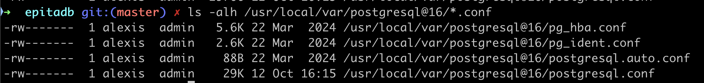

# Authentication and configuration
- [Authentication and configuration](#authentication-and-configuration)
  - [Locate the PostgreSQL  `data`  directory .](#locate-the-postgresql--data--directory-)
  - [Client authentication](#client-authentication)
    - [Host or Client auth ?](#host-or-client-auth-)
      - [peer method](#peer-method)
      - [Unix Sockets](#unix-sockets)
      - [add a specific user](#add-a-specific-user)
      - [SSH tunnel not passwords](#ssh-tunnel-not-passwords)
      - [The view : `pg_hba_file_rules`](#the-view--pg_hba_file_rules)
- [postgresql.conf](#postgresqlconf)
  - [main sections in a generic postgresql.conf file:](#main-sections-in-a-generic-postgresqlconf-file)
  - [check out](#check-out)


<https://www.postgresql.org/docs/current/auth-pg-hba-conf.html>


The configuration files for your local PostgreSQL server are located in the  PostgreSQL  `data`  directory .

## Locate the PostgreSQL  `data`  directory .

It's in the PostgreSQL  `data`  directory .

So where is this PostgreSQL  `data`  directory?


- On windows it should be in `C:\Program Files\PostgreSQL\some version\data`

- On Mac it should be in `/usr/local/var/postgresql@16` or the equivalent for your version of PostgreSQL.


In this folder you will find 2 important files

- `pg_hba.conf`
- `postgresql.conf`



## Client authentication

Client authentication is controlled by the `pg_hba.conf` configuration file.

where `HBA` stands for host-based authentication.

This file is created when the data directory is initialized by initdb.

### Host or Client auth ?

The confusion arises because "host" in pg_hba.conf isn't the opposite of "client"

- `Client` refers to any application or user trying to connect to PostgreSQL
- `Host` in `pg_hba.conf` refers to the connection method

The `pg_hba.conf` file in PostgreSQL configures client authentication, specifying methods and parameters for connections. Key authentication methods include:

1. **scram-sha-256**: Verifies passwords securely; ideal for environments needing robust security.
1. **md5**: Supports legacy compatibility, useful for environments with older clients.
2. **peer** (Unix sockets): Matches OS usernames to database users, simplifying local access control.
4. **password**: Requires plaintext passwords; suitable only for trusted networks.

These methods provide flexibility for various security levels and compatibility needs. [More details here.](https://www.postgresql.org/docs/current/auth-pg-hba-conf.html)

Let's look at one example of the pg_hba.conf file

```conf
# TYPE  DATABASE        USER            ADDRESS                 METHOD

# "local" is for Unix domain socket connections only
local   all             all                                     trust
# IPv4 local connections:
host    all             all             127.0.0.1/32            trust
# IPv6 local connections:
host    all             all             ::1/128                 trust
```

Here, The **trust** authentication method allows any user who can connect to the database to log in without a password!
This is typically used only in local environments because it grants access without verification, making it unsuitable for production or remote connections.

Another example

```conf
# TYPE  DATABASE  USER  ADDRESS      METHOD
host    paris     bob   10.0.0.0/24  scram-sha-256
local   all       alice              peer
```

Here's a detailed explanation of each line in the `pg_hba.conf` example:

```sql
# TYPE  DATABASE  USER  ADDRESS      METHOD
# First rule: Remote TCP/IP connection
host    paris     bob   10.0.0.0/24  scram-sha-256
# Second rule: Local Unix socket connection
local   all       alice              peer
```


1. First rule: `host paris bob 10.0.0.0/24 scram-sha-256`
- `TYPE = host`: Allows TCP/IP connections
- `DATABASE = paris`: Only applies to the 'paris' database (where your trees are stored)
- `USER = bob`: Only applies to user 'bob'
- `ADDRESS = 10.0.0.0/24`: Only allows connections from this subnet (IP range 10.0.0.1 to 10.0.0.254)
- `METHOD = scram-sha-256`: Uses password authentication with SCRAM-SHA-256 encryption (most secure password method in PostgreSQL)

2. Second rule: `local all alice peer`
   - `TYPE = local`: Uses Unix-domain sockets (only works when connecting from the same machine)
   - `DATABASE = all`: Applies to all databases
   - `USER = alice`: Only applies to user 'alice'
   - `ADDRESS`: Empty because local connections don't use network addresses
   - `METHOD = peer`: Authenticates using the operating system's user name (if OS user 'alice' tries to connect as PostgreSQL user 'alice', it's allowed)


#### peer method

The `peer` authentication method in PostgreSQL is used for local connections over **Unix sockets** on Linux systems.

With peer authentication, PostgreSQL checks the client’s operating system `username` and compares it to the PostgreSQL `username` attempting to connect. If they match, access is granted without requiring a password.

This method is often used for convenience in local environments, allowing trusted users to connect easily without additional login prompts. Not suitable for remote or multi-user environments.

#### Unix Sockets

A Unix socket is a special file used for inter-process communication (IPC) on Unix-like operating systems. It enables different processes on the same machine to communicate directly through the operating system's file system rather than over a network. In PostgreSQL, Unix sockets facilitate secure, efficient, and fast local connections by allowing the database server and client to exchange data without requiring TCP/IP.

#### add a specific user

to declare the user `epita` on the database `treesdb` with a password `connection` we would add the line

```
local treesdb epita  md5
```

#### SSH tunnel not passwords

Passwords are so last century!

You can use SSH with proper keys to secure PostgreSQL connections.

PostgreSQL itself does not directly support SSH-based authentication, but you can set up an SSH tunnel between the client and server. This method secures the database connection by wrapping it in SSH, allowing access without exposing the database server directly.

To set up an SSH tunnel, run this on the client machine:
```bash
ssh -L 5432:localhost:5432 user@remote_host
```
This forwards the local port 5432 to the PostgreSQL server on the remote host via SSH.


#### The view : `pg_hba_file_rules`


The `pg_hba_file_rules` view provides a summary of the contents of the client authentication configuration file

```sql
select * from pg_hba_file_rules;
 rule_number |                file_name                 | line_number | type  |   database    | user_name |  address  |                 netmask                 | auth_method | options | error
-------------+------------------------------------------+-------------+-------+---------------+-----------+-----------+-----------------------------------------+-------------+---------+--------
           1 | /usr/local/var/postgresql@16/pg_hba.conf |         117 | local | {all}         | {all}     | [null]    | [null]                                  | trust       | [null]  | [null]
           2 | /usr/local/var/postgresql@16/pg_hba.conf |         119 | host  | {all}         | {all}     | 127.0.0.1 | 255.255.255.255                         | trust       | [null]  | [null]
           3 | /usr/local/var/postgresql@16/pg_hba.conf |         121 | host  | {all}         | {all}     | ::1       | ffff:ffff:ffff:ffff:ffff:ffff:ffff:ffff | trust       | [null]  | [null]
           4 | /usr/local/var/postgresql@16/pg_hba.conf |         124 | local | {replication} | {all}     | [null]    | [null]                                  | trust       | [null]  | [null]
           5 | /usr/local/var/postgresql@16/pg_hba.conf |         125 | host  | {replication} | {all}     | 127.0.0.1 | 255.255.255.255                         | trust       | [null]  | [null]
           6 | /usr/local/var/postgresql@16/pg_hba.conf |         126 | host  | {replication} | {all}     | ::1       | ffff:ffff:ffff:ffff:ffff:ffff:ffff:ffff | trust       | [null]  | [null]
(6 rows)
```

see https://www.postgresql.org/docs/current/view-pg-hba-file-rules.html


# postgresql.conf


## main sections in a generic postgresql.conf file:

1. **Connection Settings**
- Controls how PostgreSQL accepts connections
- Defines network interfaces, **max connections**, authentication timeouts

2. **Memory Settings**
- Manages memory allocation for various operations such as joins or maintenance operations

3. **Write Ahead Log (WAL)**
- Controls database durability and recovery

4. **Query Planner**
- Influences how PostgreSQL executes queries

5. **Disk Settings**
- Controls where data is stored and how including the `data_directory` or the `log_directory` and `log_filename`

6. **Logging and Monitoring**
- Defines what gets logged and how

7. **Autovacuum Settings**
- Controls automatic cleanup of dead rows

8. **Client Connection Defaults**
- Default behaviors for client sessions: timezone, encoding, timeouts

9. **Lock Management**
- Controls deadlock handling and lock timeouts

10.  **Resource Usage**
- Controls system resource consumption: max_stack_depth, max_files_per_process, ...

The most commonly adjusted sections for basic tuning are:

- Connection Settings
- Memory Settings
- WAL Configuration
- Query Planner
- Autovacuum Settings


## check out

- Planner Cost Constants
- Where to Log
- Statement Behavior