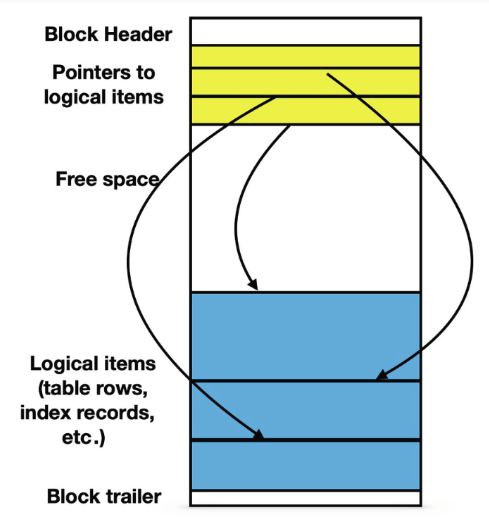

# Scope

We'll be using the latest version of the trees db : treesdb_v04.sql.gz

In this lesson we look at assessing and improving query performance with the use of the EXPLAIN command and indexes.

# Context

## Declarative language
SQL is a declarative language not an imperative language. 

We specify what the result should be, not how it's done. 

The database optimizer chooses the most efficient method to get to the result

* compilation: transform the query into a high level logical plan
* optimization: transforms logical plan into execution plan
* execution: interprets the plan


The database engine interprets SQL queries by: 
 
* parsing them into a logical plan, 
* transforming the results, 
* choosing algorithms to implement the logical plan, 
* and finally executing the chosen algorithms. 


## Relation theory

Relational database come from relation theory. 

* sets of objects: for instance A = {1,2,3}, B = {a,b,c}
* tuples are combination of element of these objects : (1,a), (1,b), …, (3, c)


A table is just a subset of all the possible combinations of the values of the columns 

A table with columns A and B that can take the values {1,2,3} and {a,b,c} is for instance:
A | B
-- | --
1 | c
1| b
3 | a
2 | b

## Everything is a relation

an operation on a relation produces … another relation:

* subset the subset
* subset the attributes

Which means:

* a query produces a relation
* a column can have values of relations 


## The Query Planifier and Query costs

Given a query, the query optimizer will find the most efficient way to execute the query.

The optimizer minimizes the cost of execution:

* uses these equivalence rules to rewrite the query
* chooses the most efficient physical operations (meaning algorithms) to execute the query

**the overall execution time of a query depends on which algorithms are chosen and whether they are chosen correctly.**


### Nodes

A node in a query plan represents a single operation or step in the execution of a query. 

Each node describes a specific action the database will perform, such as scanning a table, applying a filter, joining tables, or sorting results. 

Nodes are typically arranged in a tree structure, with **child nodes feeding results to their parent nodes**, ultimately leading to the final result of the query.


## Cost estimation

External metrics (time, cost, user satisfaction) are not accessible to the optimizer. 

Instead the optimizer combines CPU cycles and I/O accesses to derive a **cost function**. 

A cost model of a physical operation estimates the resources needed to execute the operation.


**The query optimizer which must rely on resources that affect execution time : CPU cycles and I/O accesses combined into a single cost function that it tries to minimize.**

## Blocks and storage

Any file used for database objects is divided in blocks of the same length; by default, PostgreSQL uses blocks containing 8192 bytes each. 

A block is the unit that is transferred between the hard drive and the main memory, and the number of I/O operations needed to execute any data access is equal to the number of blocks that are being read or written.


Several small items can reside in the same block; larger items may spread among several blocks.



Before we dive into indexes
let's get a feel for EXPLAIN


# Explain (Analyze) \<query\>

The engine plans the execution of the query by choosing algorithms

Postgresql optimization engine is excellent but sometimes needs troubleshooting.

Understand the optimization plan with … EXPLAIN

**important**
The optimization engine will return different plans depending on the machine it runs on
so the same query may result in different execution plans on different hardware

Adding indexes is usually a good starting point to speed up the query. But sometimes (for good reasons) the indexes are not used!


PostgreSQL devises a query plan for each query it receives. 

Choosing the right plan to match the query structure and the properties of the data is absolutely critical for good performance, so the system includes a complex planner that tries to choose good plans. You can use the EXPLAIN command to see what query plan the planner creates for any query. 

Straight from the documentation : **Plan-reading is an art that requires some experience to master, ....**

## basic example

```sql
explain select * from trees;
                          QUERY PLAN                          
--------------------------------------------------------------
 Seq Scan on trees  (cost=0.00..4577.39 rows=211339 width=50)
(1 row)
```

The query plan you've shown indicates:

The operation is a Sequential Scan on the 'trees' table : a Sequential Scan means the database is simply reading all rows from the table in order, from beginning to end. It's the most straightforward way to retrieve all data when no filtering is required.

The **width** is the estimated average size of each row in bytes.

The query plan above shows:

* The **estimated cost** ranges from 0.00 (start-up cost) to 4577.39 (total cost).
* It expects to return **211,339 rows**.
* The average **width** of each row is estimated to be 50 bytes.

Since we're selecting all columns and all rows, PostgreSQL has no choice but to read the entire table sequentially. 
This is the most efficient method for retrieving all data from a table


## Calculating query costs

The estimated cost for a Seq Scan is computed as :

* disk pages read * seq_page_cost) + (rows scanned * cpu_tuple_cost). 

By default, ```seq_page_cost = 1.0``` and ```cpu_tuple_cost = 0.01```, 

We can see the number of pages for a given table with 
```sql

SELECT relname, relkind, reltuples, relpages
FROM pg_class
WHERE relname = 'trees';
```
which returns 

  relname    | relkind | reltuples | relpages 
--------------+---------+-----------+----------
 trees        | r       |    211339 |     2464


so the estimated cost is **(2464 * 1.0) + (211339 * 0.01) = 4577.39**


## Explain analyze

EXPLAIN ANALYZE does the following

- samples the data and calculates statistics that will be used to optimize the plan (choosing the right algorithms)
- actually runs the query (does not display the output) and calculates  the time it takes to run it returns the actual number of rows


**Actual execution**: EXPLAIN ANALYZE actually runs the query, while EXPLAIN only estimates based on statistics.
**Real-time measurements**: It provides actual timing and row counts for each operation, not just estimates.
**Buffers information**: Shows details about shared and local buffer usage, including hits and reads.
**I/O timings**: Provides information about time spent on I/O operations.
**Worker information**: For parallel queries, it shows details about parallel workers used.
**Memory usage**: Provides information about memory used during query execution.
**Startup and total time**: Shows the actual time taken to start returning results and complete the query.


Also:

* EXPLAIN uses default statictics on the data 
* Once EXPLAIN ANALYZE is run, EXPLAIN uses real statistics obtained by EXPLAIN ANALYZE

But 

* since EXPLAIN ANALYZE actually runs the query ... be cautious when using it on UPDATE, INSERT or DELETE queries :)))
* use EXPLAIN first to check for missing indexes and get a rough idea about possible optimizations then after you've optimized the tables and your query, run EXPLAIN ANALYZE to get an accurate timing of the query execution

If you want to analyze a data-modifying query without changing your tables, you can roll the command back afterwards, for example:

```sql
BEGIN;

EXPLAIN ANALYZE UPDATE trees SET height = height / 10 WHERE height > 100;

ROLLBACK;
```

## How does the query planner chooses the best algorithms to execute the query ?

Basically the query planner chooses the algorithm based on many factors

- the nature of the tables and the data
- the query itself obviously 
- the type of filter (WHERE) operator : =, <, between, like '%string' etc 
- the data types of the columns involved in the filters
- the number of rows of the table, the subqueries etc 
- limit, order by
- full text search is a topic by itself
- the performance of the machine 

For each type of data (distribution, type) and indexes, etc there are specific rules and heuristics on which  the query planner will base its choice of the most efficient algorithm to execute the query.

So in the end understanding query plans, and optimizing queries and tables is an art

**Plan-reading is an art that requires some experience to master, ....**

## adding a where clause

Let's see what the query comes down to

```sql
EXPLAIN select * from trees where height < 9;
```

returns 

                          QUERY PLAN                          
--------------------------------------------------------------
 Seq Scan on trees  (cost=0.00..5105.74 rows=111270 width=50)
   Filter: (height < 9)
(2 rows)

Compare that to the original query plan without the filter

We had 

                          QUERY PLAN                          
--------------------------------------------------------------
 Seq Scan on trees  (cost=0.00..4577.39 rows=211339 width=50)


So the cost has gone up while the number of rows has gone down!

It's because we're asking the plan **node** checks the condition for each row it scans, and outputs only the ones that pass the condition. 

The estimate of output rows has been reduced because of the WHERE clause. However, the scan still has to visit all 211339 rows, so the cost hasn't decreased; in fact it has gone up a bit (by 211339 * cpu_operator_cost, to be exact) to reflect the extra CPU time spent checking the WHERE condition. 

```
treesdb_v04=# SHOW cpu_operator_cost;
 cpu_operator_cost 
-------------------
 0.0025
(1 row)
```


### filter in id (indexed)

the trees table has only one index, for the primary key id
```
treesdb_v04=# \d trees
                                       Table "public.trees"
       Column       |       Type        | Collation | Nullable |              Default              
--------------------+-------------------+-----------+----------+-----------------------------------
 idbase             | integer           |           |          | 
 id_location_legacy | character varying |           |          | 
 circumference      | integer           |           |          | 
 height             | integer           |           |          | 
 id                 | integer           |           | not null | nextval('trees_id_seq'::regclass)
 remarkable         | boolean           |           |          | 
 diameter           | double precision  |           |          | 
 anomaly            | boolean           |           | not null | false
 location_id        | integer           |           |          | 
 domain_id          | integer           |           |          | 
 stage_id           | integer           |           |          | 
 tree_taxonomy_id   | integer           |           |          | 
Indexes:
    "trees_pkey" PRIMARY KEY, btree (id)
Foreign-key constraints:
    "fk_location" FOREIGN KEY (location_id) REFERENCES locations(id)
    "fk_tree_domain" FOREIGN KEY (domain_id) REFERENCES tree_domains(id)
    "fk_tree_stage" FOREIGN KEY (stage_id) REFERENCES tree_stages(id)
    "fk_tree_taxonomy" FOREIGN KEY (tree_taxonomy_id) REFERENCES tree_taxonomy(id)
```    

Let's see how this index is put to use by the query planner if we filter on id instead of height

```sql
EXPLAIN select * from trees where id < 1000
```

We get 


```
                                  QUERY PLAN                                  
------------------------------------------------------------------------------
 Bitmap Heap Scan on trees  (cost=189.37..2777.48 rows=9929 width=50)
   Recheck Cond: (id < 10000)
   ->  Bitmap Index Scan on trees_pkey  (cost=0.00..186.89 rows=9929 width=0)
         Index Cond: (id < 10000)
(4 rows)
```

What happens here (decortiquons!)

* two step plan: child node (Botmap Indeex Scan) feeds the rows intoa  Parent Node (Bitmap Heap Scan) (Head = full table)
* the overall costs has gone down since the Parent Scan only has to check the condition on 10k rows


A bitmap in the context of database query execution is a compact data structure used to represent a set of row identifiers. Here's a simple explanation of a bitmap:

* **Structure**: It's essentially an array of bits (0s and 1s).
* **Representation**: Each bit corresponds to a row in the table. A '1' indicates the row matches the query condition, while a '0' means it doesn't.
* **Efficiency**: Bitmaps are memory-efficient for representing large sets of rows, especially when dealing with millions of records.
* **Operations**: Bitmaps allow for quick set operations (AND, OR, NOT) when combining multiple conditions.
* **Purpose**: In a Bitmap Heap Scan, the bitmap helps the database quickly identify which rows need to be fetched from the table, avoiding unnecessary I/O.


#### Difference between Bitmap Heap Scan and Seq Scan:


* Sequential Scan (Seq Scan):

* Reads all rows in the table sequentially, one after another.
    * Doesn't use any index.
    * Efficient for reading a large portion of the table.
* Bitmap Heap Scan: Uses a two-step process:
    * a) First, it creates a bitmap in memory where each bit represents a table block.
    * b) Then, it actually fetches the rows from the table based on this bitmap.
    * Often used when an index scan returns a moderate number of rows.


The key difference lies in how these methods access the data:

* "Reading sequentially" (in Seq Scan):

The database reads all data pages in order, one after another. This is efficient because it follows the natural order of data on disk.


* "Fetching rows separately" (in Bitmap Heap Scan):

After creating the bitmap, the database jumps around the table to fetch only the specific rows that match the condition.
This involves more random I/O operations, which are generally slower than sequential reads.


In the end the cost is lower with a bitmap scan because the planner has to deal with much smaller number of rows


but if the filtering is less stringent, the planner will still use a Seq Scan 

```
treesdb_v04=# EXPLAIN select * from trees where id < 150000;
                          QUERY PLAN                          
--------------------------------------------------------------
 Seq Scan on trees  (cost=0.00..5105.74 rows=149967 width=50)
   Filter: (id < 150000)
(2 rows)
```

Because then the advantage of using a bitmap scan is too small.

We could probably plot a curve by increasing the id threshold and seeing when the cutoff from Seq Scan to Bitmap Scan occurs 

### Explore some more

EXPLAIN the following queries

```sql
select * from trees where id = 808;
```

```sql
select * from trees where id < 10000 and stage_id = 1;
```

In that query, why does the cost is not lower (343 rows in the parent node)


The added condition stage_id = 1; reduces the output row count estimate, but not the cost because we still have to visit the same set of rows. Notice that the stage_id = 1 clause cannot be applied as an index condition, since this index is only on the id column. Instead it is applied as a filter on the rows retrieved by the index. Thus the cost has actually gone up slightly to reflect this extra checking.


#### equality on column with index

```
treesdb_v04=# explain select * from trees where id = 808;
                               QUERY PLAN                                
-------------------------------------------------------------------------
 Index Scan using trees_pkey on trees  (cost=0.42..8.44 rows=1 width=50)
   Index Cond: (id = 808)
```

The table rows are fetched in index order, which makes them even more expensive to read, but there are so few that the extra cost of sorting the row locations is not worth it. You'll most often see this plan type for queries that fetch just a single row. 

It's also often used for queries that have an ORDER BY condition that matches the index order, because then no extra sorting step is needed to satisfy the ORDER BY. In this example, adding ORDER BY ```id``` would use the same plan because the index already implicitly provides the requested ordering.


### much scans many index !!
meaning there's already thress types of scans

* Seq Scan
* Bitmap Heap Scan
* Index Scan

Let's recap

1. Index Scan:
- Used when: Fetching a small number of rows based on an index condition.
- How it works: 
  - Directly uses the index to find the location of rows matching the condition.
  - Then fetches those specific rows from the table.
- Efficiency: Very efficient for retrieving a small number of rows, especially with highly selective conditions.
- In your example: It's using the primary key index (trees_pkey) to quickly find the row with id = 808.

2. Sequential Scan (Seq Scan):
- Used when: Reading a large portion of the table or when no suitable index is available.
- How it works:
  - Reads all rows in the table sequentially, one after another.
  - Checks each row against the condition (if any).
- Efficiency: Efficient for reading large portions of a table, but can be slow for selective queries on large tables.

3. Bitmap Heap Scan:
- Used when: Fetching a moderate number of rows based on an index condition.
- How it works:
  - Two-step process:
    a) First, creates a bitmap in memory where each bit represents a table block that contains matching rows.
    b) Then, fetches the actual rows from the table based on this bitmap.
- Efficiency: More efficient than Index Scan when retrieving a larger number of rows, but still selective enough not to warrant a full Sequential Scan.

Key differences:

1. Data access pattern:
   - Index Scan: Might jump around the table to fetch specific rows.
   - Seq Scan: Reads the entire table sequentially.
   - Bitmap Heap Scan: First creates a map of relevant blocks, then fetches those blocks (which can be more organized than Index Scan but less sequential than Seq Scan).

2. Use of indexes:
   - Index Scan: Directly uses the index.
   - Seq Scan: Doesn't use any index.
   - Bitmap Heap Scan: Uses an index to create the bitmap, then accesses the table.

3. Suitability for different data volumes:
   - Index Scan: Best for very selective queries (few rows).
   - Seq Scan: Best for reading large portions of the table.
   - Bitmap Heap Scan: Good middle ground for moderate selectivity.

In your specific query plan, PostgreSQL chose an Index Scan because you're looking for a single row with a specific primary key (id = 808). This is the most efficient method for this type of query, as it can directly locate the exact row using the index without needing to scan multiple blocks or create intermediate bitmaps.


# Practice 15mns

Write the queries to find ....

the trees of a certain stage / species / genre, ... 
in a given arrondissement (location ...) 
with specific measures

using joins on multiple tables

EXPLAIN the queries

Look at the different types of scans 
add limits 
add order by

how do the scans change ?
Questions ?

--
Put your queries and Query plans and questions into the epitadb channel on Discord 
